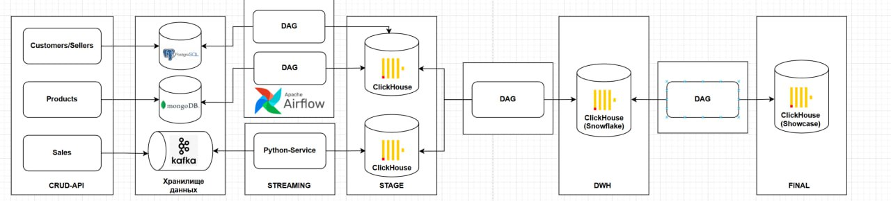
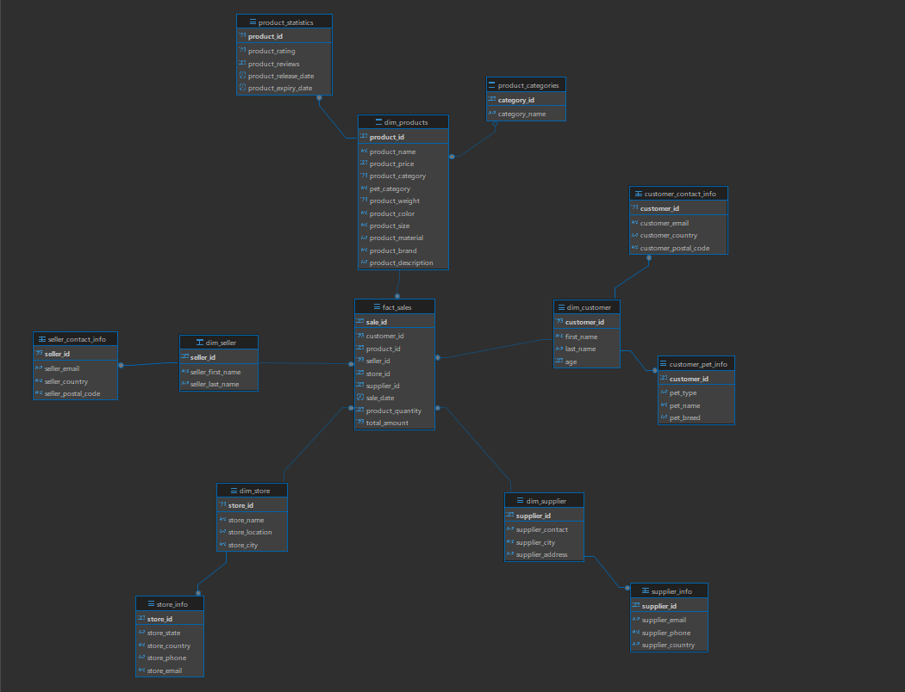
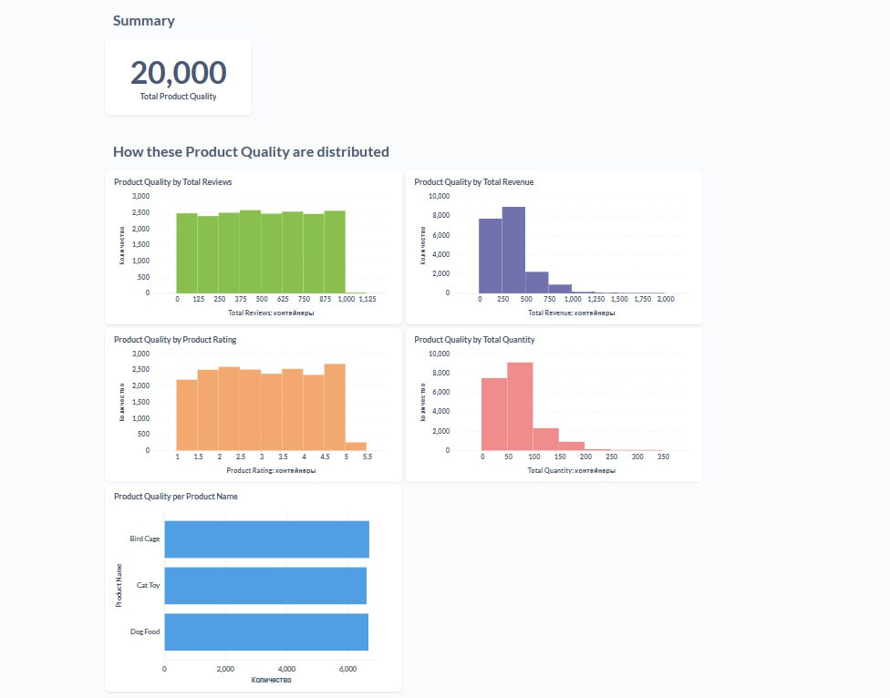
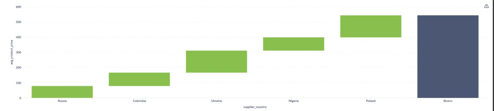
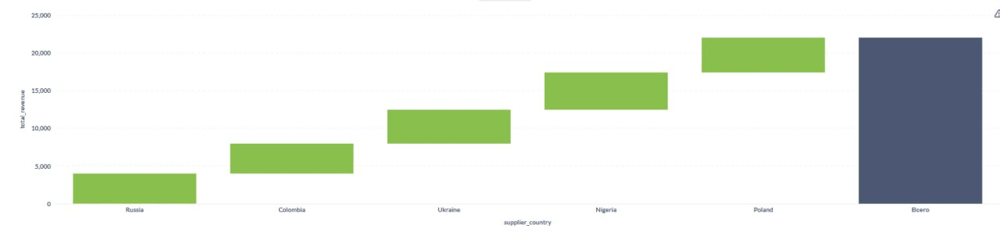
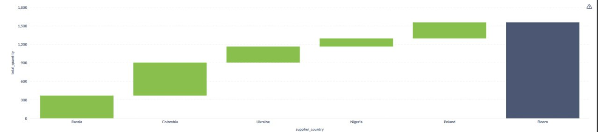

# Sales Analysis Platform

Проект представляет собой **платформу для сбора и аналитики данных о продажах**, построенную на микросервисной архитектуре с использованием реляционных и колоночных баз данных. Основные цели:

- **Сбор данных о продажах** (события продаж, информация о клиентах, продавцах, товарах).  
- **Хранение и организацию** «сырых» и агрегированных данных.  
- **Построение витрин и отчётов** для бизнес-аналитиков.  

---

## Архитектура проекта



## 1. Примеры сущностей и баз данных (из папки devops)

### 1.1. Customer (PostgreSQL)

Таблица хранит информацию о клиентах, совершающих покупки.

#### SQL-схема (PostgreSQL)

```sql
CREATE TABLE customers  (
    id Int64 PRIMARY KEY AUTO_INCREMENT,
    first_name LowCardinality(String),
    last_name LowCardinality(String),
    age Nullable(Int16),
    email String UNIQUE INDEX(email_hash SHA256(email)),
    country LowCardinality(String),
    postal_code FixedString(20),
    created_at DateTime DEFAULT now()
) ENGINE = ReplacingMergeTree(created_at)
ORDER BY (id);
```

---

### 1.2. Seller (PostgreSQL)

Таблица хранит информацию о продавцах, оформивших продажу.

#### SQL-схема (PostgreSQL)

```sql
CREATE TABLE sellers  (
    id Int64 PRIMARY KEY AUTO_INCREMENT,
    first_name LowCardinality(String),
    last_name LowCardinality(String),
    email String UNIQUE INDEX(email_hash SHA256(email)),
    country LowCardinality(String),
    region LowCardinality(String),
    postal_code FixedString(20),
    created_at DateTime DEFAULT now()
) ENGINE = ReplacingMergeTree(created_at)
ORDER BY (id);
```
---

### 1.3. Product (MongoDB)

Коллекция хранит информацию о товарах. Используется документная модель.

#### SQL-схема

```sql
CREATE TABLE products  (
    id UUID DEFAULT generateUUIDv4(),
    title String,
    description Nullable(String),
    amount Nullable(UInt32),
    brand Nullable(LowCardinality(String)),
    material Nullable(LowCardinality(String)),
    color Nullable(LowCardinality(String)),
    price Decimal(10, 2), 
    supplier_id Nullable(UInt32),
    supplier_name String,
    supplier_contact Nullable(String),
    supplier_country Nullable(LowCardinality(String)) 
) ENGINE = ReplacingMergeTree(version_column)
PARTITION BY toYYYYMM(created_at)
ORDER BY (id);
```
---

### 1.4. Sales Event (Apache Kafka)

Таблица хранит **сырые события продаж**, полученные из Kafka. 

#### SQL-схема (ClickHouse Stage)

```sql
CREATE DATABASE IF NOT EXISTS sales_db;

CREATE TABLE sales_db.sales
(
    sale_id UInt32,
    sale_date Date,
    customer_id UInt32,
    seller_id UInt32,
    product_id UInt32,
    sale_quantity UInt32,
    sale_total_price Float64,
    store_name String,
    store_location String,
    store_city String,
    store_state Nullable(String),
    store_country String,
    store_phone String,
    store_email String
)
    ENGINE = MergeTree
PARTITION BY toYYYYMM(sale_date)
ORDER BY (sale_date, store_city, product_id);
```

---

## 2. ClickHouse DWH (Хранилище данных) (Примеры)

После загрузки «сырых» событий и дополнительных атрибутов из Postgres и MongoDB формируется модель данных Снежинка.



### 2.1. Факт-таблица `fact_sales`


#### SQL-схема (ClickHouse DWH)

```sql
CREATE TABLE fact_sales (
                            sale_id UInt32,
                            customer_id UInt32,
                            product_id UInt32,
                            seller_id UInt32,
                            store_id UInt32,
                            supplier_id UInt32,
                            sale_date Date,
                            product_quantity UInt32,
                            total_amount Decimal(10,2)
) ENGINE = MergeTree
ORDER BY sale_id;
```

---

### 2.2. Таблицы-измерение (Dim Tables)

#### Dim Products

Содержит справочную информацию о товарах: ID, название, категория и тд.


```sql
CREATE TABLE dim_products (
                              product_id UInt32,
                              product_name String,
                              product_price Float32,
                              product_category UInt32,
                              pet_category String,
                              product_weight Float32,
                              product_color String,
                              product_size String,
                              product_material String,
                              product_brand String,
                              product_description String
) ENGINE = MergeTree
ORDER BY product_id;
```

---

#### Product Categories

Категории товаров.

```sql
CREATE TABLE product_categories (
                                    category_id UInt32,
                                    category_name String
) ENGINE = MergeTree
ORDER BY category_id;
```

---

#### Dim Store

Информация о точках продаж (магазинах).

```sql
CREATE TABLE dim_store (
                           store_id UInt32,
                           store_name String,
                           store_location String,
                           store_city String
) ENGINE = MergeTree
ORDER BY store_id;
```

---

#### Dim Supplier

Справочник поставщиков товаров.


```sql
CREATE TABLE dim_supplier (
                              supplier_id UInt32,
                              supplier_contact String,
                              supplier_city String,
                              supplier_address String
) ENGINE = MergeTree
ORDER BY supplier_id;
```

---

#### Dim Seller

Информация о продавцах.

```sql
CREATE TABLE dim_seller (
                            seller_id UInt32,
                            seller_first_name String,
                            seller_last_name String
) ENGINE = MergeTree
ORDER BY seller_id;
```

---

#### Customer Contact Info

Информация о клиентах (контакты).

```sql
CREATE TABLE customer_contact_info (
                                       customer_id UInt32,
                                       customer_email String,
                                       customer_country String,
                                       customer_postal_code String
) ENGINE = MergeTree
ORDER BY customer_id;
```

---

## 3.1 ClickHouse Reports (Примеры витрин)

Таблицы-отчёты с готовыми бизнес-метриками для аналитиков.


### 3.1. Sales by Product

Отчёт показывает для каждого продукта выручку, количество продаж и показатели качества.

#### SQL-схема (ClickHouse Reports)

```sql
CREATE TABLE sales_db.sales_by_product (
                                           product_id Int32,
                                           product_name String,
                                           category_name String,
                                           total_revenue Decimal(15,2),
                                           total_quantity Int32,
                                           avg_rating Float32,
                                           total_reviews Int32
)
    ENGINE = MergeTree()
ORDER BY (product_id);
```

---

### 3.2. Product Quality

Отчёт оценивает качество продукта по отзывам, рейтингу и продажам.

#### SQL-схема (ClickHouse Reports)

```sql
CREATE TABLE sales_db.product_quality (
                                          product_id Int32,
                                          product_name String,
                                          product_rating Float32,
                                          total_reviews Int32,
                                          total_revenue Decimal(15,2),
                                          total_quantity Int32
)
    ENGINE = MergeTree()
ORDER BY (product_id);
```

## 3.2 Примеры визуализации витрин из ClickHouse в Metabase

#### Распределение Product Quality



#### Средняя цена товаров по поставщикам из стран



#### Общий доход по поставикам из стран



#### Общее количество поставленных товаров по поставщикам по странам



---

## 4. Примеры схем баз данных и их взаимодействия

### 4.1. PostgreSQL (Operational DB)

- **База данных**: `postgres` (имя в Docker Compose).  
- **Таблицы**:  
  - `customers` (см. раздел 1.1).  
  - `sellers` (см. раздел 1.2).  

**Роль**: транзакционная система для CRUD-операций клиентских и продавцовских сервисов.

---

### 4.2. MongoDB (NoSQL)

- **Коллекция**: `products` (см. раздел 1.3).  
- **Роль**: хранение документов с гибкой структурой (характеристики товаров, отзывы, рейтинги).

---

### 4.3. ClickHouse Stage (Sales Raw Data)

- **База данных**: `sales_db`.  
- **Таблица**: `sales` (см. раздел 1.4).  

**Роль**: сбор «сырых» событий продаж без трансформаций. Каждое сообщение из Kafka сразу попадает сюда через Streaming Service.

---

### 4.4. ClickHouse DWH (Data Warehouse)

На основе Stage и данных из PostgreSQL/MongoDB формируется модель данных Снежинка.

- **Факт-таблица**: `fact_sales` (см. раздел 2.1).  
- **Dim Tables**:  
  - `dim_products`  
  - `product_categories`  
  - `dim_store`  
  - `dim_supplier`  
  - `dim_seller`  
  - `customer_contact_info`  

**Роль**: хранилище агрегированных данных для быстрой аналитики.

---

### 4.5. ClickHouse Reports (Data Marts / Витрины)

- **Витрины**:  
  - `sales_by_product` (см. раздел 3.1).  
  - `product_quality` (см. раздел 3.2).  

**Роль**: готовые к использованию таблицы с бизнес-метриками для аналитиков и BI-инструментов.

---


## 5. Взаимодействие компонентов

1. **Добавление клиента / продавца**  
   - Клиентское приложение отправляет HTTP-запрос к Postgres Service (`POST /customers`, `POST /sellers`).  
   - Postgres Service сохраняет записи в таблицы `customers` и `sellers` PostgreSQL.

2. **Добавление / обновление товара**  
   - Клиентское приложение обращается к Product Service (`POST /products`, `PUT /products/{id}`).  
   - Product Service сохраняет или обновляет документ в коллекции `products` MongoDB.

3. **Регистрация продажи**  
   - Клиентское приложение отправляет `POST /sales` с JSON-телом:  
     ```json
     {
       "sale_id": 1001,
       "sale_date": "2025-06-01",
       "customer_id": 5,
       "seller_id": 2,
       "product_id": 20,
       "sale_quantity": 3,
       "sale_total_price": 599.97,
       "store_name": "Магазин №1",
       "store_location": "ТЦ Центральный",
       "store_city": "Москва",
       "store_state": null,
       "store_country": "Россия",
       "store_phone": "+7 (495) 765-43-21",
       "store_email": "shop1@example.com"
     }
     ```
   - Sales Service валидирует поля и публикует сообщение в Kafka-топик `sales`.

4. **Потоковая обработка (Streaming Service)**  
   - Kafka-консьюмер читает сообщения из топика `sales`.  
   - Преобразует JSON в поля ClickHouse Stage и вставляет в таблицу `sales_db.sales`.

5. **Пакетная обработка и агрегация (Airflow)**  
   - DAG `postgres_to_clickhouse`:  
     1. Извлекает данные из PostgreSQL (клиенты, продавцы, факты продаж).  
     2. Агрегирует → загружает в DWH (`customer_contact_info`, `dim_seller`, `fact_sales`).  
   - DAG `mongodb_to_clickhouse`:  
     1. Извлекает документы из MongoDB (товары, отзывы).  
     2. Агрегирует → загружает в DWH (`dim_products`, `product_categories`, `dim_supplier`).  

6. **Аналитика и отчёты**  
   - Витрины строятся из плоских таблицы с помощью `Metabase`
